# 计算机系统简介

## 计算机的软件和硬件

计算机系统由“**硬件**”和“**软件**”两大部分组成。因为软件与硬件之间紧密的关系，因此计算机的性能取决于“软”、“硬”件功能的综合。

计算机的软件可以分为系统软件和应用软件，系统软件又称为**系统程序**，主要用来管理整个计算机系统，监视服务，使系统资源得到合理调度，高效运行。应用软件又称为应用程序，它是用户根据任务需要编制的各种程序。

- 系统软件：标准程序库、语言处理程序、操作系统、数据库管理系统、网络软件等
- 应用软件：计算器、word、markText等等。

## 计算机系统的层次结构

现代计算机的系统可以按照下图的方式进行层次结构的划分。

    

其中**操作系统**，也就是虚拟机器M2提供了在汇编语言和高级语言的使用和实现过程中所需的基本操作，还起到控制并管理计算机系统全部硬件和软件资源的作用，为用户使用计算机提供了便利。

将高级语言翻译成机器语言的程序称为**翻译程序**，有两种翻译程序，一种是**编译程序**，一种是**解释程序**。编译程序将源程序一次性全部翻译成机器语言，然后执行。解释程序将源程序边翻译边执行。

## 计算机组成和计算机体系结构

**计算机组成**和**计算机体系结构**是不同的两个概念。
- 计算机体系结构是指那些*能够被程序员所见到的计算机系统的属性*，即概念性的结构与功能特性。
- 计算机组成是指*如何实现计算机体系结构所体现的属性*，它包含了许多对程序员来说是透明的硬件细节。