# 计算机的基本组成

## 冯·诺依曼 计算机

1945年，数学家 冯·诺伊曼 提出了“**存储程序**”的概念。以此作为基础的各类计算机称为 冯·诺伊曼 计算机。它有如下的特点：

- 计算机由**运算器**、**存储器**、**控制器**、**输入设备**、**输出设备**五大部分组成。
- **指令**和**数据**以同等地位存放在存储器内，并可按地址访问。
- 指令和数据均用**二进制数**表示。
- 指令由**操作码**和**地址码**组成，操作码用来表示操作的性质，地址码用来表示操作数在存储器中的位置。
- 指令在存储器内按顺序存放。通常，指令是按顺序执行的，在特定条件下，可根据运算结构改变执行顺序。
- 机器以运算器为核心，输入输出设备与存储器间的数据传送通过运算器完成。

## 计算机的硬件框图

典型的 冯·诺伊曼 计算机是以计算器为中心的。

    

现代的计算机已经转变为以存储器为中心。

    

图中各部件的功能如下：
- 运算器用来完成算数和逻辑运算，并**将运算的中间结果暂存在运算器**内。
- 存储器用来存放数据和程序。
- 控制器用来**控制、指挥程序和数据的输入、运行以及处理运算结果**。
- 输入设备用来将人们熟知的信息形式转换为机器能识别的信息形式，常见的有键盘、鼠标等。
- 输出设备可将机器运算结果转换为人们熟悉的形式。

计算机的五大部件在控制器的统一指挥下，有条不紊地自动工作。

由于运算器和控制器在逻辑关系和电路结构上十分紧密，通常将这两大部件集成在同一芯片上，将它们统称为**中央处理器(Central Processing Unit, CPU)**。
