# 不同数制之间的转换

常用的数据表示方式有：十六进制、十进制、八进制和二进制。一个八进制数可以对应3个二进制数、一个十六进制数可以对应4个二进制数。

如下图所示，一个二进制数`110010101101`可以转变为八进制数`6255`，也可以转变为`C2D`。

    

因为二进制数和其他数制之间的转换比较方便，我们可以以二进制数为跳板，进行各种数制之间的转换。十进制整数转换为二进制数，我们可以使用**除基留余法**，十进制小数转换为二进制小数，我们可以使用**乘基取整法**。

除了使用**除基留余法**和**乘基取整法**进行数制的转换之外，我们还可以使用**拼凑法**快速进行十进制和二进制之间的数制转换。

    

如图所示：我们使用拼凑发，很快就能将一个数`563.625`转换成二进制浮点数`1000110011.101`。

两个概念：

- 真值：符合人类习惯的数字
- 机器数：数字实际存到机器里的形式，正负号需要被“数字化”。