# BCD编码

由于二进制编码和十进制编码之间的转换比较麻烦，而人类与计算机交互的过程中必然发生大量的十进制和二进制之间的数值转换。为了解决这个问题，开发了**BCD码**。

不同于传统编码之间的映射关系，BCD码使用4个bit表示一个十进制数。如图所示：

<div align = center>
    
</div>

可以看出：这种映射方法并没有映射4个bit的全部组合。如1101就没有十进制数可以映射到。

考虑两个BCD数相加的情况，如：

```
15 + 8
0001 0101 + 1000 = 0001 1101
```

转换的结果为113，而应得的结果为23，为了解决这个情况，我们规定，当两数相加所得到的二进制数不在映射中时，我们再将这个数加6。

```
0001 1101
1101不在映射中，因此我们将其加6
1101 + 0110 = 1 0011
再与前面的0001相加
0001 + 1 0011 = 0010 0011 = 23
```

## 不同的BCD编码

其实，上面我们所讲的编码方式是BCD编码中的一种，称其为**8421编码**，因为二进制中各个bit的权重分别为8、4、2、1而得名。

BCD还有两种编码形式，一种是**余3码**，余3码其实就是每个8421编码加上3，其映射关系如下。由于余3码各个位之间没有明显的权值大小关系，因此余3码是一种无权码。

<div align = center>
    
</div>

除了余3码，BCD中还有**2421码**，望文生义可只，其各个位上的权值关系分别为2、4、2、1，其映射关系如下图所示。

<div align = center>
    
</div>

仔细观察可知，对于十进制数`5`，我们有两种不同的表示方法，一种是`1011`，一种是`0101`。为了不使编码产生歧义，因此我们规定，从十进制数5开始直至十进制数9，其对应的二进制的第一位都为1。