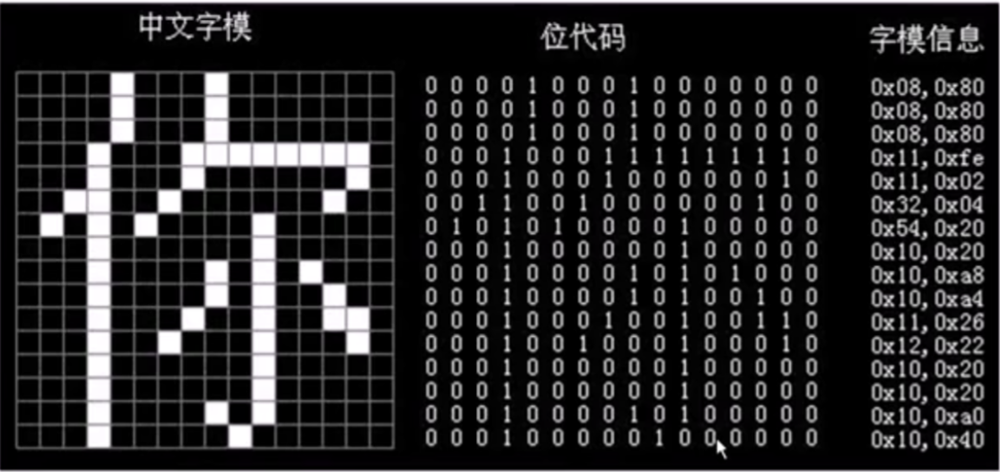

# 字符和字符串

## ASCII码

| ASCII值 | 控制字符  | ASCII值 | 控制字符  | ASCII值 | 控制字符  | ASCII值 | 控制字符|
| ------- | -------- | ------- | -------- | ------- | -------- | ------- | --------|
| 0       | NUT      | 32      | (space)  | 64      | @        | 96      | 、      |
| 1       | SOH      | 33      | !        | 65      | A        | 97      | a       |
| 2       | STX      | 34      | "        | 66      | B        | 98      | b       |
| 3       | ETX      | 35      | #        | 67      | C        | 99      | c       |
| 4       | EOT      | 36      | $        | 68      | D        | 100     | d       |
| 5       | ENQ      | 37      | %        | 69      | E        | 101     | e       |
| 6       | ACK      | 38      | &        | 70      | F        | 102     | f       |
| 7       | BEL      | 39      | ,        | 71      | G        | 103     | g       |
| 8       | BS       | 40      | (        | 72      | H        | 104     | h       |
| 9       | HT       | 41      | )        | 73      | I        | 105     | i       |
| 10      | LF       | 42      | *        | 74      | J        | 106     | j       |
| 11      | VT       | 43      | +        | 75      | K        | 107     | k       |
| 12      | FF       | 44      | ,        | 76      | L        | 108     | l       |
| 13      | CR       | 45      | -        | 77      | M        | 109     | m       |
| 14      | SO       | 46      | .        | 78      | N        | 110     | n       |
| 15      | SI       | 47      | /        | 79      | O        | 111     | o       |
| 16      | DLE      | 48      | 0        | 80      | P        | 112     | p       |
| 17      | DCI      | 49      | 1        | 81      | Q        | 113     | q       |
| 18      | DC2      | 50      | 2        | 82      | R        | 114     | r       |
| 19      | DC3      | 51      | 3        | 83      | S        | 115     | s       |
| 20      | DC4      | 52      | 4        | 84      | T        | 116     | t       |
| 21      | NAK      | 53      | 5        | 85      | U        | 117     | u       |
| 22      | SYN      | 54      | 6        | 86      | V        | 118     | v       |
| 23      | TB       | 55      | 7        | 87      | W        | 119     | w       |
| 24      | CAN      | 56      | 8        | 88      | X        | 120     | x       |
| 25      | EM       | 57      | 9        | 89      | Y        | 121     | y       |
| 26      | SUB      | 58      | :        | 90      | Z        | 122     | z       |
| 27      | ESC      | 59      | ;        | 91      | [        | 123     | {       |
| 28      | FS       | 60      | <        | 92      | /        | 124     | \|      |
| 29      | GS       | 61      | =        | 93      | ]        | 125     | }       |
| 30      | RS       | 62      | >        | 94      | ^        | 126     | `       |
| 31      | US       | 63      | ?        | 95      | _        | 127     | DEL     |

ASCII码中：
- 可印刷字符：32~126，其余为控制、通信字符
- 数字：`48(0011 0000)~57(0011 1001)`
- 大写字母：`65(0100 0001)~90(0101 1010)`
- 小写字母：`97(0110 0001)~122(0111 1010)`

## 汉字的表示和编码

由于汉字的数量众多，不可能像ASCII码一样使用一个字节进行编码表示。

因此，在`GB 2312-80`中：汉字编码使用两个字节表示，第一个字节用来表示区号，第二个字节表示字符在某个区中的位置。

`GB 2312-80`编码中，分为94个区，每个区94个位置，我们称这种编码为区位码。如字符`'啊'`，它的区位码是`16 01`，也就是第16个区的第1个字符。

由于在进行信息交换时区位码容易与控制字符发生冲突，而控制字符又常常用于信息交换，因此为了避免冲突。我们将`区位码`加上`20H`，得到`国标码`。国标码的取值范围是 `(0 + 20H ~ 93 + 20H)`，也就是`(20H ~ 7D)`，也就是`(32 ~ 125)`，不在ASCII码的控制字符范围内。

传输GB码时，我们可以使用`国标码`，但存储时显然不能，当我们的汉字与英文字符一起存储时，又会出现冲突。因此，为了避免冲突，我们再将国标码加上`80H`，得到`汉字内码`，加上了`80H(即128)`后，其实就是将每个字节的首位置1。

例如，对于汉字`'啊'`：
```
汉字'啊'的区位码如下
16 01
对应的16进制就是
10H 01H
加上20H后得到的国标码就是
30H 21H -> 0011 0000 0010 0001
再加上80H得到汉字内码
B0H A1H -> 1011 0000 1010 0001
```

还有一种称为字形码的编码，它主要关注文字在计算机中的显示问题，如图所示：
<div align = center>
    
</div>

## 字符串在计算机中的存储形式

某计算机**按字节编址**，从地址为2的单元开始，存储字符串"abc啊"，各字符的编码如下：
```
a: 01100001 = 61H
b: 01100010 = 62H
c: 01100011 = 63H
啊: 机内码 = B0 A1H
\0：00000000 = 00H
```
字符串一般都以'\0'字符结尾。字符串"abc啊"在计算机中的存储方式有以下两种：

<div align = center>
    
</div>

注意到两种存储方式的区别在于B0H和A1H的存放位置不同。

这两种存储方式分别称为`大端模式`和`小端模式`：
- 大端模式：将数据的最高有效字节存放在低地址单元中
- 小端模式：将数据的最高有效字节存放在高地址单元中。

