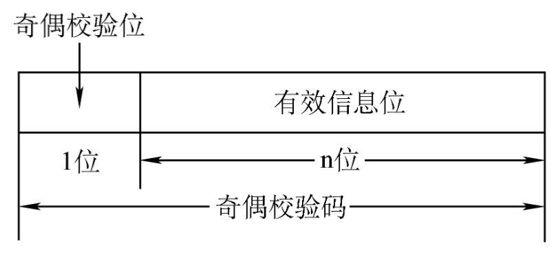

# 奇偶效验码

## 基本概念

1. 由若干位代码组成的一个字叫`码字`。
2. 将两个码字逐位进行比较，具有不同的位的个数称为`两个码字间的距离`。
3. 一种编码方案可能有若干个合法码字，各合法码字间的最小距离称为`"码距"`

    

- 奇校验码：整个校验码（有效信息位和校验位）中“1”的个数为奇数。
- 偶校验码：整个校验码（有效信息位和校验位）中“1”的个数为偶数。

    

上图中的3bit映射方案即为在2bit映射方案的编码首位加上了一个奇效验位。

## 奇偶效验码的特点

奇偶效验码的码距 $d = 2$， 仅能检测出奇数位错误，无纠错能力。